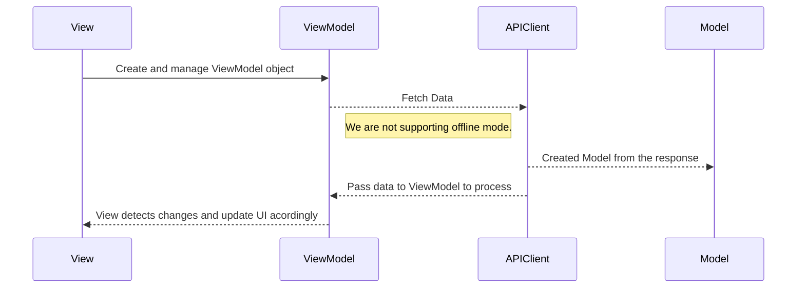

# github-repos

## Table of Contents
1. [Demo](#Demo)
2. [Project Overview](#Project-Overview)
3. [API](#API)
4. [Directory Structure](#Directory-Structure)
5. [Test Cases](#Test-Cases) 
6. [Error Handling](#Error-Handling)
7. [UML Diagram](#UML-Diagram)
8. [Memory Check](#Memory-Check) 


### Demo


### Project Overview

This project is an iOS application built using **SwiftUI**, adhering to **MVVM Architecture** principles. The project follows a structured approach to ensure that the codebase is scalable, testable, and maintainable.
I didn't use any model to store the data so all data will be retreived online.

### API:
I'm using GitHub API token to get users ans associated repositories. Adding the access token to the CI/CD and add actions to GitHub to retreive the token stored there is the most secured way but it needs a provision profile and certificate.
Instead, I used Xcode Environment Variables and pushed it to github, I used keychain to store and retreive this token when working in read device. 

### Directory Structure:


This project follows **MVVM Architecture**, which divides the codebase into clear layers:

1.  **View Layer**: Responsible for UI (SwiftUI).
2.  **ViewModel Layer**: Handles business logic, connect view to model.
3.  **Model Layer**: Contains entities and Network layer.

Each layer has its own responsibility and communicates through well-defined interfaces (protocols), ensuring loose coupling and high testability. 


Example View

``` swift
struct RepositoriesDetailsView: View {
    
    var user: UserJSON
    @StateObject var repositoryViewModel = RepositoriesViewModel()
    @ObservedObject var usersViewModel: UsersViewModel
    @State private var presentAlert = false
    
    var body: some View {
        VStack {
            HStack {
                AsyncImage(url: URL(string: user.avatar_url)) { image in
                    image.resizable()
                } placeholder: {
                    ProgressView()
                }
                .frame(width: 100, height: 100)
                .clipShape(Circle())
            }
            
            Text("Username: \(user.login)")
            Text("Full Name:\(user.name ?? "--")")
            Text("Number of Followers:\(user.followers ?? 0)")
            Text("Number of Following:\(user.following ?? 0)")
            Spacer()
            
            Text("List of Repositories")
            .font(.headline)
            
            Text("Count of repo \(repositoryViewModel.reposArray.count)")
            
            // List of repos
            List {
                ForEach(Array(repositoryViewModel.reposArray.enumerated()), id: \.offset) { index, repo in
                    HStack {
                        
                        Text(repo.name)
                            .font(.subheadline)
                        Text(repo.language ?? "--")
                            .font(.subheadline)
                        Text("Stars: \(repo.stargazers_count)")
                            .font(.footnote)
                            .foregroundColor(.gray)
                        Text(repo.description ?? "--")
                            .font(.footnote)
                            .foregroundColor(.gray)
                        
                    }
                    .onAppear {
                        // Trigger loading of next page if this is the last user
                        if index == repositoryViewModel.reposArray.count - 1 {
                            Task {
                                await repositoryViewModel.loadRepos(forUser: user.login) // Load rest page
                            }
                        }
                    }
                }
                
                if repositoryViewModel.isLoading {
                    ProgressView() // Show loading indicator
                }
            }
            .accessibilityIdentifier("ReposList")
            
        }
        .navigationTitle(user.login)
        .onAppear() {
            Task {
                await usersViewModel.getUserDetails(for: user)
                await repositoryViewModel.loadRepos(forUser: user.login)
            }
        }
        .onChange(of: usersViewModel.error ?? ChatError()) { _,error in
            if error.errorMessage != nil {
                self.presentAlert = (error.errorMessage != nil)
            }
        }
        .showAlert(isPresented: $presentAlert, title: "Error", message: usersViewModel.error?.errorMessage ?? "Unknown Error")
    }
}
```

Example ViewModel

``` swift
final class RepositoriesViewModel: AbstractViewModel {
    
    // Vars
    var nextUserUrl: String?
    @Published var user: UserJSON!
    @Published var reposArray: [RepoJSON] = []
     

    // MARK:- Remote APIs
    @MainActor
    func loadRepos(forUser login: String) async {
                
        guard !isLoading else { return } // Prevent multiple API calls
        
        isLoading = true
        error = nil
        
        let result = await apiClient.getRepoList(fromUrl: nextUserUrl, ofUser: login)
        
        switch result {
        case .success(let (reposArray, nextUrl)):
            self.reposArray.append(contentsOf: reposArray) // Append new repos to the list
            
            // Handle pagination
            self.nextUserUrl = nextUrl
            
        case .failure(let chatError):
            error = chatError
        }
        
        isLoading = false // Reset loading state

    }
}
```

Example Model (APIClient)

``` swift
func getRepoList(fromUrl nextUserUrl: String? = nil, ofUser userLogin: String) async -> (Result<([RepoJSON], String?), ChatError>) {
        
        // Create url request
        
        var urlString: String!
        if let urlStoredValue = nextUserUrl {
            urlString = urlStoredValue
        } else {
            urlString = baseURL + "/users/\(userLogin)/repos?type=sources"
        }
        
        guard let url = URL(string: urlString) else {
            var chatError = ChatError()
            chatError.errorMessage = "INVALID_URL"
            return .failure(chatError)
        }
        
        var request = URLRequest(url: url)
        
        
        
        if let githubToken = getAccessToken() {
            request.setValue("token \(githubToken)", forHTTPHeaderField: "Authorization")
        } else {
            var chatError = ChatError()
            chatError.errorMessage = "No GitHub token found"
            return .failure(chatError)
        }
        
        do {
            let (data, response) = try await URLSession.shared.data(for: request)
            
            guard let _ = response as? HTTPURLResponse else {
                var chatError = ChatError()
                chatError.errorMessage = "Invalid response"
                return .failure(chatError)
            }
            
            
            let decoder = JSONDecoder()
            let reposArray = try decoder.decode([RepoJSON].self, from: data)
            
            var nextUrl: String?
            if let httpResponse = response as? HTTPURLResponse, let str = httpResponse.allHeaderFields["Link"] as? String {
                nextUrl = extractNextUrl(fromString: str)
            }
            
            // Filter repositories to include only forks
            // According to the documentation, we should add type=sources to get non-forked repos. But as this is not working as
            // expected, I will filter here (ref: https://docs.github.com/en/rest/repos/repos?apiVersion=2022-11-28)
            let forkedRepos = reposArray.filter { $0.fork }
            
            return .success((forkedRepos, nextUrl))
        } catch {
            var chatError = ChatError()
            chatError.errorMessage = "USERS_PARSING_ERROR"
            return .failure(chatError)
        }
    }
``` 

### Test Cases
Thanks to MVVM and protocols, we can test each ViewModel separatelty by using a mock APIClient. I also used a simple UITest to check users list, repos list and pagination.  


### Error Handling
- I'm using a simple alert view in displaying all kinds of errors.
- All errors are mapped to AppError.


## UML Diagram

The flow of our app works as follows



## Memory Check
Using Memory Debugger Tool and Instruments to check for any leaks or extra instances of any object


No leaks found


Check for a single instance of each object and no retain Cycle deteced
